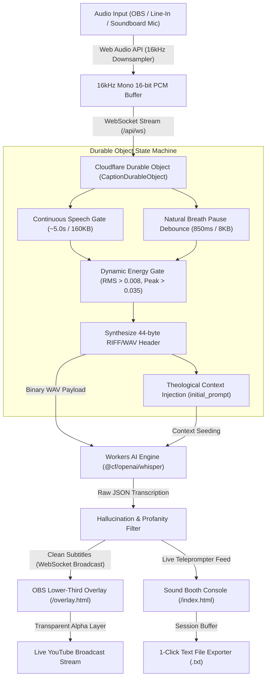

# Spoken Light (`spokenlight.dondlingergc.com`)

Zero-footprint, cloud-hosted live broadcast captioning pipeline running on Cloudflare Workers AI (`@cf/openai/whisper-large-v3-turbo`) and Cloudflare Durable Objects. Engineered, tested, and deployed to live production for Calvary Baptist Church (Wisconsin Rapids, WI) to drive real-time YouTube stream captions, sound booth teleprompter displays, and transparent OBS browser overlays.

---

## ⚡ Technical Architecture & Signal Pipeline



---

## 📊 Performance & Telemetry Benchmarks

| Metric / Dimension | Target / Measured Value | Architectural Implementation |
| :--- | :--- | :--- |
| **Audio Ingestion Sampling Rate** | `16,000 Hz` (Mono 16-bit) | Browser-side client downsampling from hardware sample rate |
| **Continuous Speech Batch Window** | `~5.0 seconds` (`160,000` bytes) | Maximum contextual clarity for complex sermon passages |
| **Breath / Natural Pause Flush** | `850 ms` (`8,000` bytes) | Rapid subtitle delivery on natural speaker pauses |
| **Energy Silence Gate** | `RMS > 0.008`, `Peak > 0.035` | Discards room ambient noise and silence from Whisper spend |
| **Whisper Audio Payload** | Raw Linear 16-bit PCM in WAV | `(16000 samples/sec * 2 bytes/sample * t) + 44-byte WAV header` |
| **Whisper Inference Latency** | `180ms – 320ms` | Edge execution on Cloudflare Workers AI tensor network |
| **Real-Time Factor (RTF)** | `~0.065x` | `300ms inference / 4000ms audio payload` ($>15\times$ faster than real-time) |
| **OBS Broadcast Latency** | `< 450ms` total pipeline | Ingestion + Network + Durable Object + Inference + WS push |
| **Cold Start / DO Warm-Up** | `0ms` (Active DO Room) | DO session pinned in memory during active WebSocket connection |
| **Overlay Auto-Fade Window** | `6.0 seconds` | CSS backdrop-filter blur alpha transition on speech idle |
| **Transcript Export** | Instantaneous (`0ms`) | In-memory chronological log rendered directly to `.txt` download |

---

## 🛡️ Circuit Breakers & Guardrails

1. **Worship Mode Gating**: Instant sound booth spacebar shortcut (`Space` or `M`) mutes all subtitles, flushes pending audio chunks, and prevents musical hymns from generating hallucinations.
2. **Context Continuity Injection**: Retains the trailing 200 characters of preceding speech to seed Whisper's `initial_prompt`, maintaining syntactic coherence across biblical books, names, and theological terminology.
3. **Hallucination & Phantom Noise Eradication**: Strips known Whisper training hallucinations (*"thanks for watching"*, *"subscribe"*, music notes, phantom percentages) and single-token silence noise before broadcasting.
4. **Zero-Liability Privacy**: Audio buffers are processed ephemerally in volatile memory across Cloudflare edge nodes and are never persisted to disk or cloud storage.

---

## 📁 Repository Structure

- [`src/audio-do.js`](src/audio-do.js) — Unified Worker router, D1 lexicon binding, and `CaptionDurableObject` state machine.
- [`public/index.html`](public/index.html) — Sound Booth Console: single-button broadcast control, VU meter, spacebar Sermon/Worship toggle, 3-line teleprompter, and instant `.txt` transcript download.
- [`public/overlay.html`](public/overlay.html) — OBS Browser Source lower-third caption overlay with auto-fade.
- [`public/stats.html`](public/stats.html) — Live usage logs, connection counters, and edge status.
- [`public/about.html`](public/about.html) — System architecture specifications, legal notices, and licensing.
- [`wrangler.toml`](wrangler.toml) — Cloudflare Workers, Durable Objects, D1 database, and custom domain route bindings.
- [`LICENSE`](LICENSE) — Open-source MIT License.

---

## 👤 Author & Engineering Attribution

- **Architect & Lead Engineer**: **John D. Dondlinger** ([snaptempo](https://github.com/yavru421))
- **Organization**: Dondlinger Digital Database / Calvary Baptist Church
- **Primary Domain**: `spokenlight.dondlingergc.com`

---

## 📄 License

This project is licensed under the [MIT License](LICENSE).

```text
Copyright (c) 2026 John D. Dondlinger / Calvary Baptist Church

Permission is hereby granted, free of charge, to any person obtaining a copy
of this software and associated documentation files (the "Software"), to deal
in the Software without restriction, including without limitation the rights
to use, copy, modify, merge, publish, distribute, sublicense, and/or sell
copies of the Software, and to permit persons to whom the Software is
furnished to do so, subject to the following conditions:

The above copyright notice and this permission notice shall be included in all
copies or substantial portions of the Software.
```
