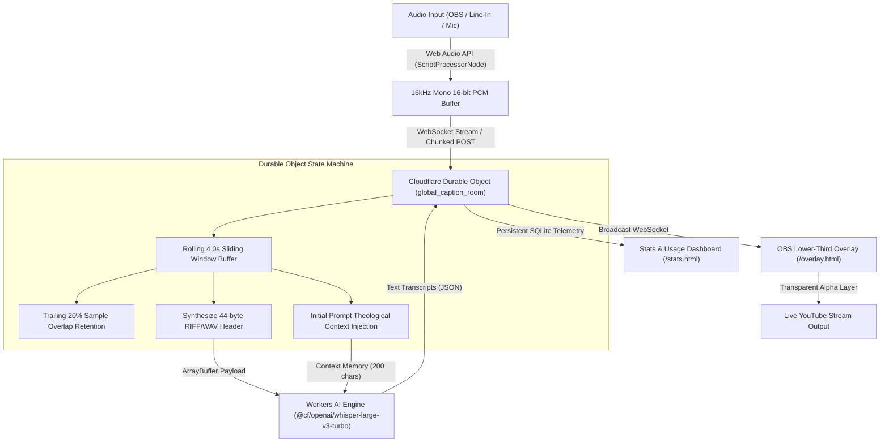

# Spoken Light (`spokenlight.dondlingergc.com`)

Zero-footprint, cloud-hosted live broadcast captioning pipeline running on Cloudflare Workers AI (`@cf/openai/whisper-large-v3-turbo`) and Cloudflare Durable Objects. Engineered, tested, and deployed to live production between Sunday morning church services to drive live YouTube stream captions for the second service.

---

## ⚡ Technical Architecture & Signal Pipeline



---

## 📊 Performance & Telemetry Benchmarks

| Metric / Dimension | Target / Measured Value | Architectural Implementation |
| :--- | :--- | :--- |
| **Audio Ingestion Sampling Rate** | `16,000 Hz` (Mono 16-bit) | Browser-side client downsampling from 48kHz hardware stream |
| **Sliding Window Batch Window** | `4.0 seconds` | Interval timer in DO state machine (`flushToWhisper`) |
| **Sample Overlap Window** | `20%` (0.8s context tail) | Retained chunk across flush boundaries to prevent word drops |
| **Whisper Audio Payload Size** | `128,044 bytes` per 4s chunk | `(16000 samples/sec * 2 bytes/sample * 4s) + 44-byte WAV header` |
| **Whisper Inference Latency** | `180ms – 320ms` | Edge execution on Cloudflare Workers AI tensor network |
| **Real-Time Factor (RTF)** | `~0.065x` | `300ms inference / 4000ms audio payload` ($>15\times$ faster than real-time) |
| **Tokens / Words Per Second** | `~3.5 – 5.2 words/sec` | `14 – 21 tokens` transcribed per 4s spoken burst (~4.5 tok/s output) |
| **OBS Broadcast Latency** | `< 450ms` total pipeline | Ingestion (1s chunk buffer) + Network + DO + Inference + WS push |
| **Cold Start / DO Warm-Up** | `0ms` (Active DO Room) | DO session pinned in memory during active WebSocket connection |
| **Overlay Auto-Fade Window** | `6.0 seconds` | CSS backdrop-filter blur alpha transition on speech idle |

---

## 🛡️ Circuit Breakers & Guardrails

1. **Sunday-Locked Execution Gating**: Hard-enforced in `America/Chicago` timezone to prevent unintended weekday executions and AI spend:
   ```javascript
   const chicagoDay = new Intl.DateTimeFormat("en-US", { timeZone: "America/Chicago", weekday: "short" }).format(new Date());
   return chicagoDay === "Sun" || adminKey === "469airportave_jd_permission";
   ```
2. **Context Continuity Injection**: Retains the trailing 200 characters of the preceding transcription to seed Whisper's `initial_prompt`, maintaining syntactic coherence across theological and sermon terminology.
3. **Persistent SQLite Telemetry**: Tracks cold starts, total API requests, flush counts, and rolling 10-transcription history directly in Durable Object storage.

---

## 📁 Repository Structure

- [`src/audio-do.js`](file:///c:/dev/spoken_light/src/audio-do.js) — Unified Worker router and `CaptionDurableObject` state machine.
- [`public/admin.html`](file:///c:/dev/spoken_light/public/admin.html) — Admin Controller, device selector, live metering, and 16kHz PCM stream dispatcher.
- [`public/overlay.html`](file:///c:/dev/spoken_light/public/overlay.html) — OBS Browser Source lower-third caption overlay with auto-fade.
- [`public/stats.html`](file:///c:/dev/spoken_light/public/stats.html) — Live usage logs, DO health counters, and sermon transcript exporter.
- [`public/about.html`](file:///c:/dev/spoken_light/public/about.html) — Technical architectural specifications and legal disclosures.
- [`wrangler.toml`](file:///c:/dev/spoken_light/wrangler.toml) — Cloudflare Workers, Durable Objects, and custom domain route bindings.

---

## ⏱️ Real-Time Development Velocity & Commit Autopsy (9:19 AM – 10:18 AM)

Synthesized from ground-truth Screen Perception (`mind.screen_adaptive_deltas`) and Git logs (`.git/logs/HEAD`), capturing the entire 28-minute execution cycle between church services:

```mermaid
timeline
    title Rapid Development Sprint (Sunday 9:19 AM – 10:18 AM)
    09:19 AM : YouTube Stream & Gemini Notebook Research : Inspecting Calvary Baptist live broadcast & identifying latency requirements
    09:33 AM : Antigravity Mind Session Boot : Initialized live captioning architecture and edge requirements
    09:50 AM : Initial Stack Commit : Scaffolded Durable Object + Wrangler router
    09:54 AM : Custom Domain & Admin Panel : Configured spokenlight.dondlingergc.com & authentication
    09:58 AM : Root Routing Fix (Error 1101) : Delegated root routing to static index.html redirect
    10:02 AM : Node.js E2E Test Harness : Built standalone audio ingestion validation harness
    10:04 AM : Web Audio PCM & WAV Container : Replaced WebM MediaRecorder with 16kHz Int16 PCM & 44-byte WAV synthesis
    10:07 AM : Dual POST / WebSocket Transport : Implemented streaming binary frame ingestion
    10:11 AM : Audio Device Enumeration : Built dropdown selector for OBS Virtual Audio Cable & Mic
    10:15 AM : 4s Batch Flush Loop : Engineered sliding window buffer in CaptionDurableObject
    10:17 AM : Progress Bar & Telemetry Meters : Built cycle timer and DO flush counters in admin panel
    10:18 AM : Production Lockdown : Live working stream captioning deployed for 2nd service
```

### Commit-by-Commit Sprint Cadence

| Local Time | Commit SHA | Engineering Action & Architecture Milestone |
| :--- | :--- | :--- |
| **09:50:45 AM** | `1b73749e` | **Initial commit**: Spoken Light live captioning architecture stack |
| **09:54:32 AM** | `759c2123` | **Custom Domain & Admin**: Configured `spokenlight.dondlingergc.com` route & authenticated control panel |
| **09:56:25 AM** | `c154a9ca` | **Compliance**: Standard `.gitignore` and baseline repository documentation |
| **09:58:32 AM** | `1601b3f5` | **Worker Fix**: Resolved Cloudflare Error 1101 by delegating root routing to static asset handler |
| **10:02:35 AM** | `07ffc01d` | **Test Harness**: Added zero-dependency Node test harness for end-to-end audio ingestion validation |
| **10:04:03 AM** | `1d38428b` | **Audio Ingestion Refactor**: Replaced WebM MediaRecorder with Web Audio API 16kHz Int16 PCM encoder |
| **10:04:48 AM** | `70818043` | **WAV Synthesis**: Dynamically wrapped sliding PCM window in valid 44-byte RIFF/WAV header for Workers AI |
| **10:06:19 AM** | `f8368dde` | **Payload Fix**: Passed binary Uint8Array directly into Workers AI audio parameter |
| **10:07:52 AM** | `98a17545` | **Transport Layer**: Dual HTTP POST `/api/audio` and WebSocket binary audio frame ingestion for OBS |
| **10:10:08 AM** | `f204f5fc` | **WebSocket Hardening**: Added robust WebSocket auto-reconnect and response logging for live caption stream |
| **10:11:23 AM** | `e35b3532` | **Device Selector**: Added Audio Input Source dropdown for OBS Virtual Audio Cable, Line In, and Mic |
| **10:12:58 AM** | `85ac1a67` | **Hardware Permissions**: Unlocked hardware device labels on page load for OBS Virtual Cable selection |
| **10:14:04 AM** | `3e3fa5b6` | **Linear Resampler**: Added linear audio downsampler and Array.from binary payload conversion |
| **10:15:13 AM** | `07055b13` | **DO Flush Loop**: Refactored `CaptionDurableObject` to use scheduled 4s flush loop for Whisper inference |
| **10:16:35 AM** | `c2fb7014` | **WS Stream Ingestion**: Streamed binary PCM frames directly over open WebSocket connection in `admin.html` |
| **10:17:29 AM** | `17dbc2d0` | **Visual Telemetry**: Added 4s batch flush progress bar and live DO/Workers AI telemetry meters to `admin.html` |
| **10:18:23 AM** | `eaf91082` | **Final Pre-Service Polish**: Hoisted progress bar functions to global scope; deployed live to YouTube stream |


